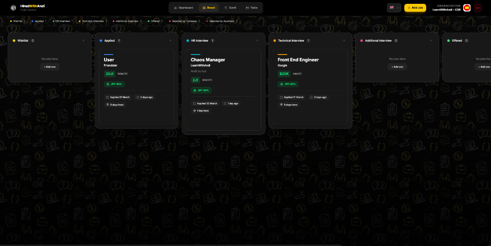
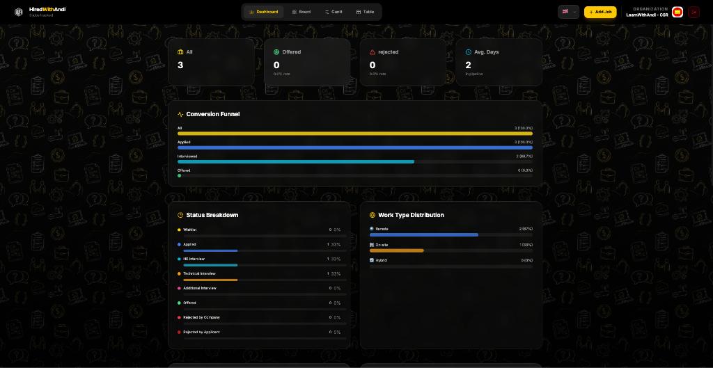
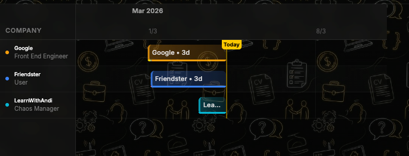

# HireWithAndi - Job Tracker






A comprehensive and visually appealing job application tracking system designed to help you organize, manage, and analyze your job search journey.

## Features

- **Kanban Board Interface**: Drag and drop job applications across customizable stages (Wishlist, Applied, HR Interview, Technical Interview, Additional Interview, Offered, Rejected by Company, Rejected by Applicant).
- **Detailed Job Records**: Store extensive information including company, position, salary, location, work type (Remote/On-site/Hybrid), and custom notes.
- **Offer Management**: Special fields for recording final offer details, benefits, and non-monetary perks when an application reaches the 'Offered' stage.
- **Timeline & Analytics Dashboard**:
  - Visualize application history through a functional Gantt chart.
  - Track key metrics like days since the first application, last interview, and last rejection.
  - Monitor the status of your latest job application.
  - **Active Duration Tracking**: Time spent in final states (Offered, Rejected by Company, Rejected by Applicant) is intelligently paused for more accurate timeline metrics.
- **Bilingual Support (i18n)**: Seamlessly toggle between English and Bahasa Indonesia.
- **Secure Cloud API Integration**: Seamless integration with a secure backend API ensuring robust session management, email verification, and persistent data storage out of the box.
- **User Identity & Profile**: Complete authentication system supporting customizable User Profiles with multi-part avatar uploads, bio, and read-only organization tracking.
- **Actionable Superadmin Role**: Native support for global administrative privileges across the stack.
- **Premium Engaging UI**: Featuring doodle background patterns, clean glassmorphism elements, and smooth modern animations giving it a polished premium feel.

## Prerequisites

- Node.js (v18 or higher recommended)
- npm, yarn, or pnpm

## Installation

1. Clone the repository:

   ```bash
   git clone <repository-url>
   cd job-tracker
   ```

2. Install dependencies:
   ```bash
   npm install
   ```

## Running the Application

Start the development server:

```bash
npm run dev
```

The application will be available at the URL provided in your terminal (typically `http://localhost:5173`).

## Building for Production

To create a production build:

```bash
npm run build
```

To preview the production build locally:

```bash
npm run preview
```

---

## 🚀 Ubuntu VPS Setup Guide (Nginx + PM2)

This guide assumes a fresh Ubuntu 22.04/24.04 LTS server.

### 1. System Update & Dependencies

```bash
sudo apt update && sudo apt upgrade -y
sudo apt install -y curl git nginx
```

### 2. Node.js Installation (nvm)

```bash
curl -o- https://raw.githubusercontent.com/nvm-sh/nvm/v0.39.7/install.sh | bash
source ~/.bashrc
nvm install 20
```

### 3. Application Deployment

```bash
git clone <repository-url>
cd job-tracker
npm install
```

Create `.env.local` file:

```bash
nano .env.local
```

Add your production API URL:

```env
VITE_API_URL=https://your-api-domain.com/api
```

### 4. Build for Production

```bash
npm run build
```

### 5. Serving with PM2

We use PM2 to serve the static files:

```bash
npm install -g pm2
pm2 serve dist 5177 --name hwa-tracker --spa
pm2 save
pm2 startup
```

### 6. Nginx Reverse Proxy

```bash
sudo nano /etc/nginx/sites-available/hwa-tracker
```

Add configuration:

```nginx
server {
    listen 80;
    server_name your_tracker_domain_or_ip;

    location / {
        proxy_pass http://localhost:5177;
        proxy_http_version 1.1;
        proxy_set_header Upgrade $http_upgrade;
        proxy_set_header Connection 'upgrade';
        proxy_set_header Host $host;
        proxy_cache_bypass $http_upgrade;
    }
}
```

Enable and restart:

```bash
sudo ln -s /etc/nginx/sites-available/hwa-tracker /etc/nginx/sites-enabled/
sudo nginx -t
sudo systemctl restart nginx
```

---

## Technologies Used

- React 19
- Vite
- Tailwind CSS 4
- @hello-pangea/dnd (for drag and drop)
- Lucide React (for icons)
